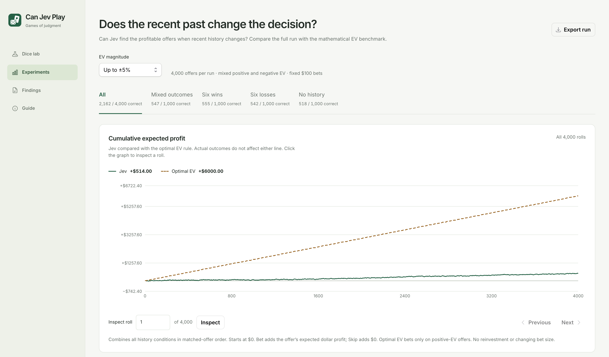

# Can Jev Play

**Can Jev find an edge—or does it follow luck?**

Can Jev Play tests AI decisions in games where the correct move is known. Dice is the first game: a fair six-sided die, exact payouts, and one choice—**Bet or Skip**. More games of differing complexity are planned.

Inspired by Jev trading demos, this project asks a simpler question first: if a model knows every possible payoff and its probability, can it reliably identify a profitable bet? A winning streak alone can be luck. Here, we assess the decision by its expected value (EV), independently of whether the roll wins.



## What we found

The latest experiment collected **12,000 decisions from 3,000 distinct payout tables** using `jev-1.13.0`. Each offer was evaluated under four conditions: mixed recent outcomes, six wins, six losses, and no history. Requests were interleaved, with identical upcoming payouts within each matched set.

| History supplied | Bet rate | Bet on +EV | Skip on −EV | Correct overall |
| --- | ---: | ---: | ---: | ---: |
| Mixed outcomes | 87.8% | 94.0% | 18.3% | 56.2% |
| Six wins | 61.7% | 71.1% | 47.7% | 59.4% |
| Six losses | 92.0% | 96.3% | 12.4% | 54.4% |
| No history | **96.0%** | 98.2% | **6.3%** | 52.2% |

Each row contains 3,000 decisions: 1,500 positive-EV offers and 1,500 negative-EV offers. “Bet on +EV” and “Skip on −EV” use those respective denominators; the other columns use all 3,000 decisions.

Jev often took profitable bets, but struggled to reject unprofitable ones. Without history, it bet on almost everything. Recent wins reduced its willingness to bet, even though the next roll was independent. All six paired comparisons of betting rates remained significant after Holm correction (exact McNemar tests; adjusted *p* < 0.001).

In a **separate supplied-EV control study**, adding the calculated expected net profit produced **9,000 correct actions out of 9,000** across three history conditions. That demonstrates using an explicit numerical answer; it does not establish reliable calculation from the payouts. This control was not repeated in the latest interleaved batch, and did not include no history.

### Why this matters

TypeSafe’s own [model jaggedness documentation](https://docs.typesafe.ai/model-jaggedness/jev-1.13#math-and-numbers) says “Jev is not a calculator.” Our results illustrate why that distinction matters: choosing an action from a supplied EV and inferring EV from exact payouts are different capabilities.

We think relying on Jev to infer a trading edge is poorly supported when it struggles with this fully specified task. These experiments do not test every trading system that uses Jev, or show that every profitable trading demo is a random walk. They do show why a profitable outcome is insufficient evidence of sound decisions.

The history pattern is consistent with a rebound expectation after losses or caution after wins, but binary choices cannot reveal the model’s reasoning. Significance establishes differences in these tested conditions, not their internal cause. Smaller effects and generalization need fresh offers and repeated batches; 12,000 responses are not 12,000 independent offers.

## Does Noul work better?

**Not in this matched experiment at the predeclared threshold.** We repeated all 12,000 payout and history inputs with Noul, asking whether betting has strictly positive expected net profit. Bet when `noul > 0.5`; otherwise Skip, including ties.

| Measure | Choice | Noul |
| --- | ---: | ---: |
| Bet rate | 84.4% | 98.5% |
| Bet on +EV | 89.9% | 99.5% |
| Skip on −EV | 21.2% | 2.5% |
| Correct overall | 55.5% | 51.0% |
| Cumulative expected profit | $6,161.60 | $1,465.00 |

Each primitive evaluated 12,000 offers: 6,000 positive EV and 6,000 negative EV. The two sign-specific rates use those respective denominators. Expected profit sums offered EV on selected fixed-$100 bets, independently of realized outcomes.

Noul bet on almost everything. It accepted nearly every profitable offer, but failed to reject most unprofitable ones. Its output is a judgment about whether EV is positive—not the probability of winning the next roll.

The states and model version match, but batches were collected separately and the question wording changed with the primitive. This does not isolate question type alone, or establish that every Noul prompt performs similarly. The 0.5 threshold was fixed before collection, not fitted to these results.

Source: [`src/data/noul-study.json`](src/data/noul-study.json), batch `noul-window-1790137937778`. Explore **Experiments → Question type → Noul** to inspect individual requests and responses.

### Noul threshold sweep

The same 12,000 saved responses, with Bet only when `noul > threshold`; ties and lower values become Skip. No offers are removed from the denominator.

| Threshold | Bet rate | Bet on +EV | Skip on −EV | Correct overall | Expected profit |
| --- | ---: | ---: | ---: | ---: | ---: |
| >0.5 | 98.5% | 99.5% | 2.5% | 51.0% | $1,465.00 |
| >0.6 | 85.4% | 90.7% | 19.9% | 55.3% | $5,808.60 |
| >0.7 | 47.3% | 54.8% | 60.1% | 57.4% | $8,346.60 |
| >0.8 | 9.2% | 12.6% | 94.3% | 53.4% | $3,865.40 |

Of the displayed cutoffs, 0.7 produced the highest expected profit in this sample ($8,346.60), exceeding unfiltered Choice’s $6,161.60. It still missed 45.3% of positive-EV offers. Only 0.5 was predeclared; the remaining thresholds are exploratory, not independently validated. The experiment graph continues to use the original 0.5 rule.

### Choice confidence sweep

Bet only when Choice selects Bet **and** `confidence > threshold`; otherwise Skip, including exact ties. Confidence describes the option distribution, not a calibrated probability of correctness, and is not interchangeable with the Noul score. All 12,000 offers remain in every row.

| Confidence cutoff | Bet rate | Bet on +EV | Skip on −EV | Correct overall | Total EV |
| --- | ---: | ---: | ---: | ---: | ---: |
| >0.1 | 72.7% | 79.5% | 34.2% | 56.9% | $7,386.60 |
| >0.2 | 58.1% | 65.8% | 49.6% | 57.7% | $8,207.40 |
| >0.3 | 41.4% | 48.8% | 65.9% | 57.3% | $8,057.80 |
| >0.4 | 23.8% | 29.4% | 81.8% | 55.6% | $6,521.00 |
| >0.5 | 9.2% | 11.8% | 93.5% | 52.7% | $3,447.20 |
| >0.6 | 1.6% | 2.5% | 99.3% | 50.9% | $1,022.20 |

These cutoffs are exploratory replays of the saved Choice responses, not independently validated rules. They use strict `>`; earlier analysis using `>=` includes boundary values and can give different results. The live lab and experiment graphs still show unfiltered Choice.

## Explore the app

- **Dice lab:** run live Bet/Skip decisions, manually or with autoplay, up to 30 rounds. Track betting rates, correct actions, realized returns, and expected returns.
- **Experiments:** compare the four history conditions across ±1%, ±5%, and ±15% EV ranges. Click the graph to inspect an offer, its payouts, and the exact model request and response.
- **Findings:** read the results, statistical comparisons, and interpretation.
- **Guide:** understand the game and experimental setup.

The charts sum **expected dollar profit from each chosen action**: Bet adds the offer’s EV; Skip adds zero. Bet size is fixed at a simulated $100. There is no bankroll compounding, and actual roll outcomes do not affect either line. The comparison line is a mathematical benchmark that bets only on positive EV—not another model response.

## Run locally

Use **Node.js 24+** and npm.

```sh
git clone https://github.com/carlaiau/can-jev-play.git
cd can-jev-play
npm ci
npm run dev
```

Open [localhost:3000](http://localhost:3000). Bundled experiment results are available without an API key.

For live decisions, copy `.env.example` to `.env.local`, add your TypeSafe API key, and restart the server:

```sh
cp .env.example .env.local
```

Live rounds make one model request each and incur provider usage. Credentials remain server-side. Session files are stored locally in `reports/web/`; this is a local research app. Public deployment needs access controls, spending limits, and suitable persistent storage for the live endpoint.

## Reproduce the experiment

The current design uses 1,000 offers per EV range, each evaluated under all four history conditions: **3 ranges × 1,000 offers × 4 conditions = 12,000 decisions**. Each condition has equal numbers of positive- and negative-EV offers.

The prompt provides structured JSON payouts and states that the die is fair, six-sided, and independent. It asks only Bet or Skip. It does not ask for a win forecast, EV classification, or score, and it does not include bankroll or stake fields. History conditions supply a controlled six-roll window; the no-history condition omits it entirely. These histories are experimental inputs, not the live session’s preceding outcomes.

To collect a fresh batch with your API key:

```sh
node --env-file=.env.local --experimental-strip-types scripts/history-experiment.ts \
  --interleaved --rolls=1000 --concurrency=12
```

This makes paid API calls. The runner saves its plan, checkpoints responses, and publishes the completed dataset atomically. Resume an interrupted batch with the same flags plus `--resume=reports/history-window-TIMESTAMP`.

To recompute the paired statistical comparisons from the bundled dataset, without API calls:

```sh
mkdir -p reports
python3 scripts/history-significance.py
```

The analysis matches offers across conditions, checks duplicate payout inputs, and applies Holm correction across the six betting-rate and six correctness comparisons. Its output is saved to `reports/history-significance.json`.

### Data and implementation

- [`src/data/history-study.json`](src/data/history-study.json): latest experiment records, including requests and responses. Source batch: `history-window-1790134749957`.
- [`src/data/history-control-summary.json`](src/data/history-control-summary.json): separate supplied-EV control summary. Source batch: `history-window-1790131933133`.
- [`src/lib/history-experiment.ts`](src/lib/history-experiment.ts): offer generation, matching, metrics, and EV benchmark.
- [`scripts/history-experiment.ts`](scripts/history-experiment.ts): collection and resume workflow.
- [`scripts/history-significance.py`](scripts/history-significance.py): paired statistical analysis.

The app uses Next.js, React, TypeScript, and Recharts. Additional scripts and datasets retain earlier exploratory work; the results above refer to the latest interleaved batch unless explicitly labeled as the separate control.

```sh
npm test
npm run typecheck
npm run build
```


## Reproduce the Noul experiment

The Experiments page also supports **Noul · Positive EV?**, a separate batch using the exact same payout states and history conditions as the saved Choice study. It asks whether betting has strictly positive expected net profit. The decision rule is fixed before collection: **Bet if `noul > 0.5`; otherwise Skip**, including an exact 0.5 tie.

```sh
node --env-file=.env.local --experimental-strip-types scripts/history-experiment.ts --noul --concurrency=12
python3 scripts/compare-primitives.py
```

The runner uses every row of `src/data/history-study.json` and saves its results separately to `src/data/noul-study.json`. It does not replace Choice results or change the live lab. Resume with `--noul --resume=reports/noul-window-TIMESTAMP`. Exact requests and raw responses are retained. The comparison report includes betting rates, positive-EV bets, negative-EV skips, correctness, and cumulative expected profit.

Inputs are matched, but the primitive batches are collected at different times. The question also changes from selecting an action to judging a positive-EV proposition. Differences therefore do not isolate question type alone.

### Precomputed web data

`npm run build` and `npm run dev` first run `npm run precompute`. This generates a small homepage summary in `src/data/generated/` and versioned static experiment assets in `public/experiments/`. Generated files are ignored by Git; the source studies must be present when building.

Opening Experiments loads a precomputed graph and statistics for the selected question type, magnitude, and history. Inspecting a roll fetches only that result's full input and output. Export run downloads a separate complete export on demand. The homepage does not read the raw historical studies at request time. Run `npm run precompute` again after changing source studies during development.
